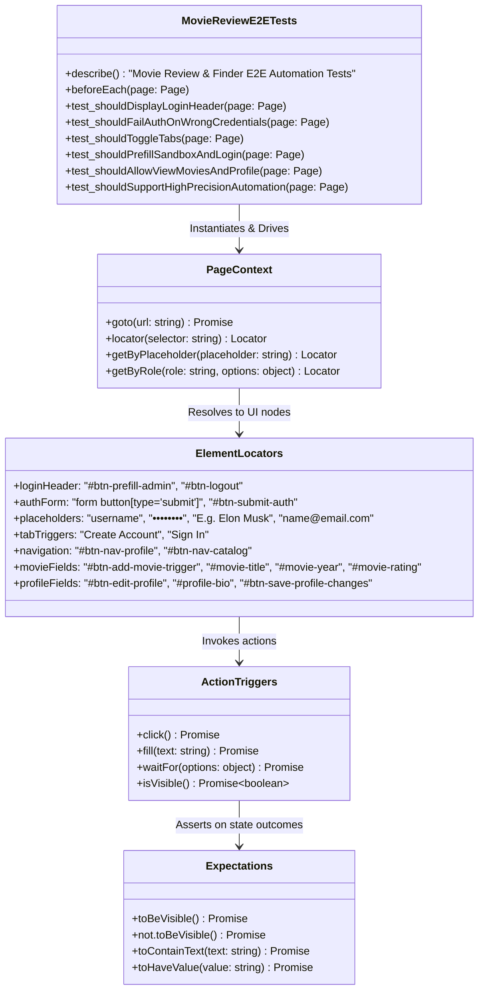
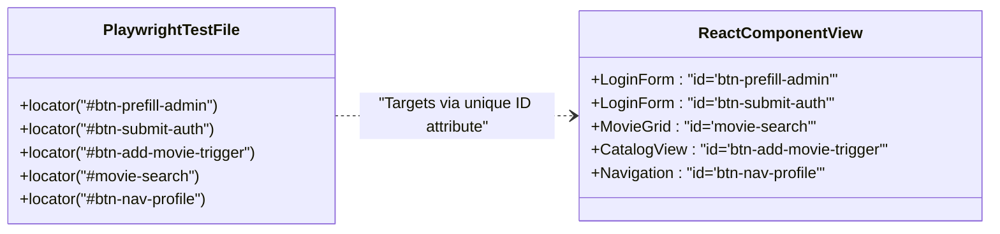

# TECHNICAL DOCUMENT 4: TEST AUTOMATION UML DIAGRAMS & DOMAIN SPECIFICATION
## Movie Review & Finder Web Application

This document provides a highly detailed, precise set of UML diagrams and structural domain models mapping the actual Playwright E2E automation tests (`e2e/auth-and-movies.spec.ts`) generated for the Movie Review & Finder application.

---

## 1. Playwright Test Suite Structural Class Diagram

This class-level structural diagram represents the design, modules, and relationships within our actual E2E test file (`e2e/auth-and-movies.spec.ts`), including the helper functions, Page object representations, selector handles, and expectations.

---

## 2. Test Execution & Self-Healing Sequence Diagram

This sequence diagram illustrates the step-by-step execution path of our tests, detailing how Playwright starts, handles active session cleanup (`beforeEach` self-healing logic), performs targeted interactions, and evaluates conditions.

```mermaid
sequenceDiagram
    autonumber
    actor PlaywrightRunner as Playwright Runner
    participant Browser as Chromium Browser
    participant ExpressApp as Express Backend
    participant SQLite as SQLite Database

    PlaywrightRunner->>Browser: Launch Headless Browser & page.goto("/")
    Browser->>ExpressApp: GET /
    ExpressApp-->>Browser: Return HTML, Tailwind & JS Bundle
    Note over Browser: App Initial Loading State Resolved

    rect rgb(30, 41, 59)
        Note over PlaywrightRunner, Browser: self-healing block: [beforeEach]
        PlaywrightRunner->>Browser: Check if "#btn-logout" is visible
        alt Session Cookie is active (User logged in)
            Browser-->>PlaywrightRunner: returns True
            PlaywrightRunner->>Browser: Click "#btn-logout"
            Browser->>ExpressApp: POST /api/auth/logout
            ExpressApp-->>Browser: Clear Session Cookies
            PlaywrightRunner->>Browser: Assert Header contains "Login for Movie Review & Finder"
        else No session exists (Fresh State)
            Browser-->>PlaywrightRunner: returns False
        end
    end

    rect rgb(16, 185, 129)
        Note over PlaywrightRunner, Browser: test: "should support high-precision automation"
        PlaywrightRunner->>Browser: Click "#btn-prefill-admin"
        PlaywrightRunner->>Browser: Click "#btn-submit-auth"
        Browser->>ExpressApp: POST /api/auth/login
        ExpressApp->>SQLite: Verify credentials (admin/admin)
        SQLite-->>ExpressApp: Match success
        ExpressApp-->>Browser: Set Session Cookie & User Profile
        PlaywrightRunner->>Browser: Click "#btn-add-movie-trigger"
        PlaywrightRunner->>Browser: Fill movie details (#movie-title, etc.)
        PlaywrightRunner->>Browser: Click "#btn-movie-submit"
        Browser->>ExpressApp: POST /api/movies
        ExpressApp->>SQLite: INSERT INTO movies (id, title, ...)
        ExpressApp-->>Browser: Return { success: true }
        PlaywrightRunner->>Browser: Fill "#movie-search" with 'Matrix'
        PlaywrightRunner->>Browser: Assert 'The Matrix Resurrections' (.first()) is visible
    end
```

---

## 3. High-Precision Selector Domain Model

This model demonstrates the direct, strict mapping between the automation test locators used in `auth-and-movies.spec.ts` and the exact DOM elements of our React front-end. It emphasizes how custom test attributes protect tests against selector breakage.

---

## 4. Key Automation Capabilities Mapped

Our automation tests are structured to cover these exact mechanics:

1.  **State Setup & Reset**:
    *   `page.goto('/')` ensures routing starts at a clean origin.
    *   An active check on `#btn-logout` terminates any lingering sessions, achieving **test isolation**.
2.  **Element Queries & Scope Restriction**:
    *   `page.locator('form button[type="submit"]')` scopes target buttons strictly to form elements.
    *   `page.getByRole('button', { name: 'Edit Profile' })` utilizes modern accessibility (ARIA) tree selectors.
3.  **Ambiguity Handling**:
    *   `.first()` (e.g. `page.locator('text=The Matrix Resurrections').first()`) prevents strictness violations when multiple objects match queries.
