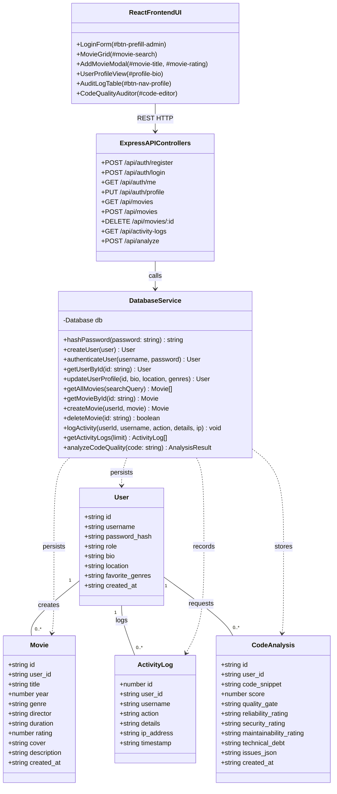
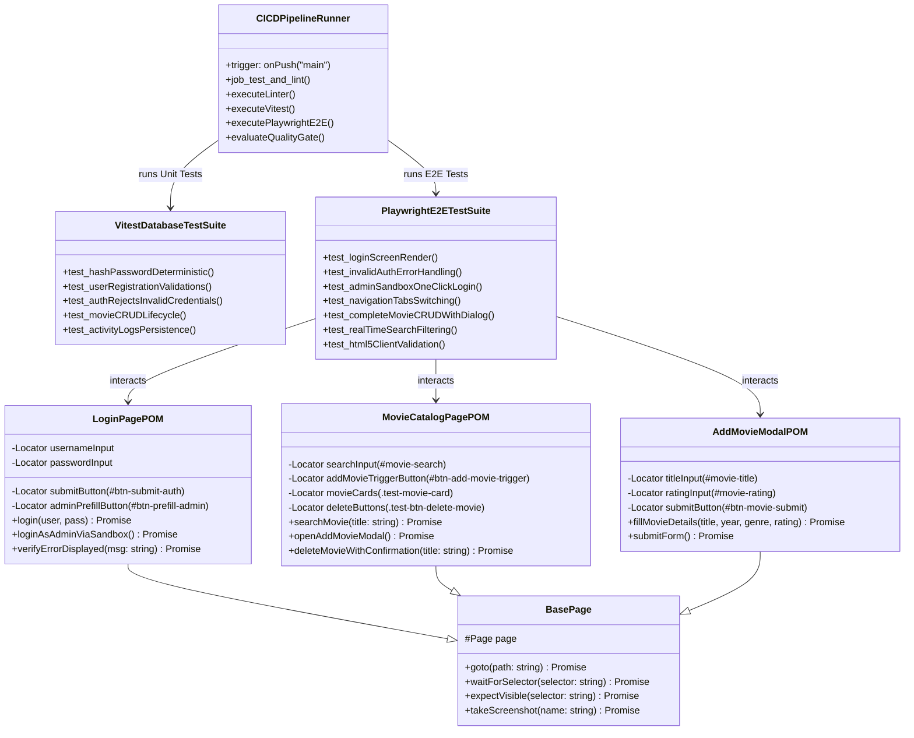

# UML Dijagrami Projekta i Uputstvo za Besplatne Alate

Ovaj dokument sadrži specifikacije i kodove dijagrama koji se mogu direktno kopirati u besplatne UML alate ili otvoriti u namenskom generisanom PDF-u.

## 📄 Generisani Zasebni Fajlovi
- **`UML_DIJAGRAMI.pdf`** *(u root-u i u `/docs/`)* — Zaseban PDF dokument sa svim dijagramima.
- **`PRIMENA_DEVOPS_CICD_DOKUMENTACIJA.pdf`** — Glavna tehnička DevOps & CI/CD dokumentacija.
- **`/docs/dijagrami/1_arhitektura_sistema.puml`** — PlantUML izvorni kod arhitekture sistema.
- **`/docs/dijagrami/2_test_automation_framework.puml`** — PlantUML izvorni kod okvira za testiranje.

---

## 🛠️ Besplatni Alati za Otvaranje i Editovanje UML Dijagrama

1. **Mermaid Live Editor (Web - Bez instalacije):**
   - URL: [https://mermaid.live](https://mermaid.live)
   - Samo prekopirajte Mermaid kod ispod i odmah dobijate interaktivni dijagram sa mogućnošću izvoza u PNG, SVG ili PDF.

2. **PlantUML Online Server (Web - Bez instalacije):**
   - URL: [http://www.plantuml.com/plantuml](http://www.plantuml.com/plantuml)
   - Otvorite `.puml` fajl iz `/docs/dijagrami/` foldera ili kopirajte `@startuml ... @enduml` blok.

3. **Draw.io / Diagrams.net (Web & Desktop):**
   - URL: [https://app.diagrams.net](https://app.diagrams.net)
   - U meniju izaberite: **Arrange > Insert > Advanced > Mermaid** (ili **PlantUML**) i zalepite kod.

---

## 📊 Dijagram 1: Arhitektura Sistema i Domenski Model (Mermaid Kod)

---

## 🎭 Dijagram 2: Okvir za Automatizaciju Testova (Mermaid Kod)

